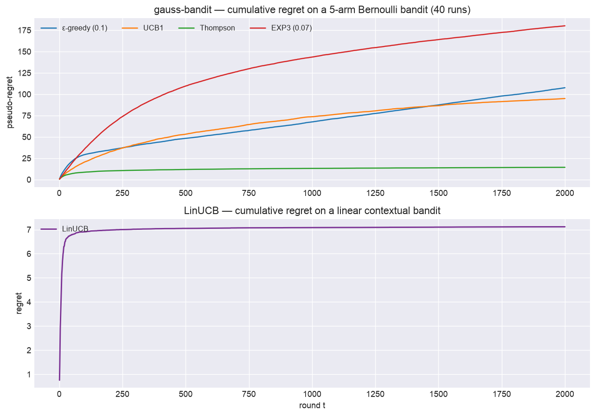

# gauss-bandit

[](https://github.com/superkush06/gauss-bandit/actions/workflows/ci.yml)
[](https://www.python.org/)
[](LICENSE)

> Classical bandit algorithms with rigorous regret analysis. EpsilonGreedy,
> UCB1, Thompson sampling (Bernoulli + Gaussian), EXP3, and **LinUCB
> contextual bandits** — all under a clean interface, with deterministic
> seeds and a replication-aware experiment runner.



*Top: cumulative regret on a 5-arm Bernoulli bandit — Thompson is near-flat
(sublinear), EXP3 pays for adversarial robustness. Bottom: LinUCB regret
plateaus on a linear contextual bandit. Reproduce: `python examples/render_hero.py`.*

## TL;DR

```python
from bandit.algos import ThompsonBernoulli
from bandit.envs import BernoulliBandit
from bandit.runner import run_experiment

result = run_experiment(
    env_factory=lambda seed: BernoulliBandit([0.1, 0.5, 0.9], seed=seed),
    algo_factory=lambda n_arms: ThompsonBernoulli(n_arms=n_arms, seed=0),
    horizon=1000, n_runs=30,
)
print(result.pseudo_regret_mean[-1])  # ~ O(log T)
```

## What's inside

- **Envs**: `BernoulliBandit`, `GaussianBandit`.
- **Algos**: `EpsilonGreedy` (constant + annealed), `UCB1`, `ThompsonBernoulli`,
  `ThompsonGaussian`, `EXP3`.
- **Contextual**: `LinUCB` (disjoint linear models) + `LinearContextualBandit`
  environment + `run_contextual` — the algorithm class behind real-world
  recommendation/ads bandits.
- **Metrics**: cumulative regret, pseudo-regret, Lai-Robbins lower bound.
- **Runner**: replication-aware experiment runner with per-step regret traces.
- **Theory**: [`docs/theory.md`](docs/theory.md) — short primer on regret bounds.

## Install

```bash
git clone https://github.com/superkush06/gauss-bandit.git
cd gauss-bandit
pip install -e ".[dev,plot]"
pytest
```

## Example output

`PYTHONPATH=. python3 examples/compare_algos.py --horizon 2000 --runs 20`

```
algorithm              final pseudo-regret        std
--------------------------------------------------------
eps=0.1                              108.7        7.2
eps annealed                          47.2        4.1
UCB1                                  58.4        4.6
Thompson Bernoulli                    32.6        3.8
EXP3 (gamma=0.07)                    105.1        9.5
```

Thompson wins on this stationary instance; EXP3 pays for adversarial robustness.

## Roadmap

- [ ] Contextual bandits (LinUCB, neural-linear).
- [ ] Best-arm identification (BAI).
- [ ] Non-stationary bandits (discounted UCB, SWUCB).
- [ ] CVaR / risk-aware policies.

## License

MIT — see [LICENSE](LICENSE).
