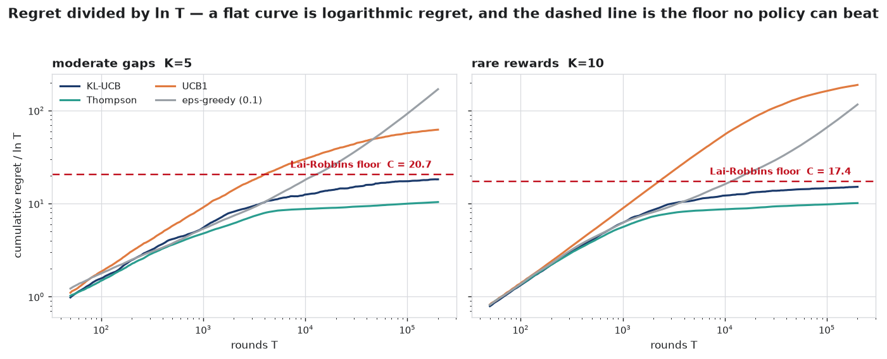
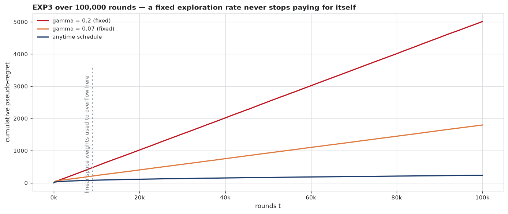
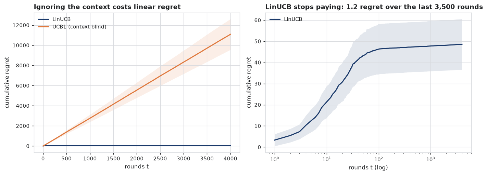

# gauss-bandit

[](https://github.com/superkush06/gauss-bandit/actions/workflows/ci.yml)
[](https://www.python.org/)
[](LICENSE)

**Bandit algorithms, held to the bound they are supposed to meet.**

Every bandit library ships UCB1 and a chart of regret going up. What the chart
cannot tell you is whether the number at the end is any good. Lai and Robbins
settled that in 1985: for a given instance there is a constant $C$ such that no
consistent policy can have regret below $C \ln T$, and $C$ is computable from
the environment. This library computes it, implements a policy that provably
attains it, and measures everything else against the same yardstick — in the
figures below, in [`docs/validation.md`](docs/validation.md), and in the test
suite.



Dividing regret by $\ln T$ is the trick that makes the whole field legible: a
policy with logarithmic regret flattens out, a policy with linear regret keeps
climbing, and the dashed line is the floor. **KL-UCB** and **Thompson** flatten
and stay under it. **UCB1** sails straight through — by 3x on the left, by 11x
on the right, where the arm means sit near 0.01 and its Hoeffding bonus is at
its loosest. Curves below the line are not a contradiction: the bound is
asymptotic, and both optimal policies approach it from underneath.

## Install

```bash
git clone https://github.com/superkush06/gauss-bandit.git
cd gauss-bandit
pip install -e ".[dev,plot]"
pytest
```

Pure Python and NumPy at runtime. Matplotlib is needed only to redraw the
figures.

## Sixty seconds

```python
import math
from bandit import KLUCB, BernoulliBandit, lai_robbins_lower_bound, run_experiment

probs = [0.10, 0.02, 0.02, 0.01, 0.01]          # five rare-reward arms
floor = lai_robbins_lower_bound(BernoulliBandit(probs))

result = run_experiment(
    env_factory=lambda seed: BernoulliBandit(probs, seed=seed),
    algo_factory=lambda n_arms, seed: KLUCB(n_arms=n_arms),
    horizon=20_000, n_runs=10,
)

print(f"Lai-Robbins constant C   {floor:.2f}")
print(f"the floor, C ln T        {floor * math.log(20_000):.1f}")
print(f"KL-UCB regret at T       {result.pseudo_regret_mean[-1]:.1f}")
```

```
Lai-Robbins constant C   5.64
the floor, C ln T        55.9
KL-UCB regret at T       49.0
```

Both factories are seeded by the runner — `env_factory(seed)` and
`algo_factory(n_arms, seed)` each get their own stream per replication — so a
run reproduces end to end, and a seed you pass is a seed that gets used.

## What's here

| | |
|---|---|
| **Environments** | `BernoulliBandit`, `GaussianBandit` (per-arm sigmas), `LinearContextualBandit` |
| **Index policies** | `UCB1`; `KLUCB`, whose index is solved by bisection on the binary KL |
| **Posterior sampling** | `ThompsonBernoulli` (Beta conjugate), `ThompsonGaussian` (known variance) |
| **Adversarial** | `EXP3` — log-space weights, decaying `anytime_gamma` schedule |
| **Contextual** | `LinUCB` — disjoint linear models, inverse by Sherman-Morrison |
| **Baselines** | `EpsilonGreedy`, constant or `annealed` |
| **Metrics** | `cumulative_regret`, `cumulative_pseudo_regret`, `lai_robbins_lower_bound`, `bernoulli_kl`, `gaussian_kl` |
| **Harness** | `run_one`, `run_experiment` (replications, per-step traces), `run_contextual` |

## The lower bound is a real function

It dispatches on the environment's reward *family*, not on where its means
happen to fall. Same means, three different answers:

```python
>>> from bandit import BernoulliBandit, GaussianBandit, lai_robbins_lower_bound
>>> lai_robbins_lower_bound(BernoulliBandit([0.50, 0.45, 0.40]))
14.949643878630045
>>> lai_robbins_lower_bound(GaussianBandit([0.50, 0.45, 0.40], sigmas=[1.0, 1.0, 1.0]))
60.00000000000002
>>> lai_robbins_lower_bound(GaussianBandit([0.50, 0.45, 0.40], sigmas=[5.0, 5.0, 5.0]))
1500.0000000000005
>>> lai_robbins_lower_bound(BernoulliBandit([0.50, 1.00]))   # KL = inf: free to rule out
0.0
```

That same divergence drives KL-UCB's index, which is why the two meet. Its
confidence bonus against the Hoeffding bonus UCB1 uses, at a per-arm budget of
0.001 on an arm averaging 2%:

```python
>>> from bandit import klucb_index
>>> klucb_index(0.02, level=0.001)     # KL-UCB's optimistic mean
0.026912775039672848
>>> 0.02 + (0.001 / 2) ** 0.5          # what Pinsker, and so UCB1, allows
0.0423606797749979
```

Nearly three times narrower, and every unit of unearned optimism is a pull
spent on the wrong arm.

## Where the policies actually land

`python3 examples/optimality.py` — five arms with means from 0.10
down to 0.01, ten replications, about six seconds:

```
K=5 Bernoulli [0.1, 0.02, 0.02, 0.01, 0.01]
Lai-Robbins constant C = 5.64  (regret >= 5.64 ln T for any consistent policy)
10 runs x 20,000 rounds

R(T) / (C ln T)   — 1.00 is the asymptotic floor
policy                     T=100     T=1,000     T=5,000    T=20,000
--------------------------------------------------------------------
KL-UCB                      0.21        0.57        0.75        0.88
Thompson                    0.22        0.47        0.52        0.57
UCB1                        0.25        1.44        4.32        8.12
eps-greedy (0.1)            0.23        0.45        0.95        2.61
```

Read the rows left to right. KL-UCB climbs toward 1.00 and flattens as it
arrives — that is what asymptotic optimality looks like from the inside, and
the chart at the top carries the story out to T = 200,000. UCB1 crosses 1.00
before T = 1,000 and keeps going: still logarithmic, but with a constant eight
times larger than it needs to be. ε-greedy is not logarithmic at all, and one
more column would make that obvious.

At short horizons the ranking is different, which is worth knowing before
choosing a policy for a two-week experiment:

`python3 examples/compare_algos.py --horizon 2000 --runs 20`

```
Horizon: 2000, Runs: 20, K=10, best arm prob=0.80
Lai-Robbins: any consistent policy has regret >= 14.08 ln T ~ 107.0 at this horizon
algorithm               final pseudo-regret        std
--------------------------------------------------------
eps=0.1                              123.66      71.41
eps annealed                          84.98     129.69
UCB1                                 224.80      18.45
KL-UCB                                72.71      11.49
Thompson Bernoulli                    53.59      12.97
EXP3 (anytime)                       224.25      61.79
```

Thompson wins here and KL-UCB is second; both sit below the asymptotic floor
because 2,000 rounds is nowhere near asymptotic. Watch the standard deviations
too — annealed ε-greedy beats UCB1 on the mean with seven times the spread,
which is exactly what a mean-only table hides.

## Does it meet the bounds it cites?

Citing a theorem in a docstring is free. [`docs/validation.md`](docs/validation.md)
is the version that costs something: every policy measured against the
guarantee it claims, next to the script that produced the number.

`python3 examples/validate.py --long`

| claim | ours | reference | source |
|---|---:|---:|---|
| UCB1 regret at T = 50,000, below the guarantee | 552.6 | ≤ 3608.7 | Auer, Cesa-Bianchi & Fischer (2002), Thm 1 |
| the same run, above the floor | 552.6 | ≥ 223.6 | Lai & Robbins (1985) |
| EXP3 weak regret at the tuned γ | 1537.5 | ≤ 2813.0 | Auer, Cesa-Bianchi, Freund & Schapire (2002), Cor 3.2 |
| LinUCB elliptical potential ÷ 2 ln det A(T) | 0.457 | ≤ 1 | determinant lemma |
| UCB1's exact E[R(14)] by path enumeration | 1.118369 | 1.117497 ± 0.000850 | 200,000 Monte-Carlo runs |

The last row is the one I would check first in someone else's bandit library.
UCB1 is a deterministic function of the rewards it observes, so its expected
regret over fourteen rounds can be computed by walking all $2^{14}$ reward
paths and weighting each by its probability — no sampling, no bound, no
citation to get wrong. It agrees with two hundred thousand simulated runs to
about one standard error, which pins the environment, the index and the
regret accounting simultaneously.

Two claims do not come out clean, and the doc says so at length rather than
burying it: KL-UCB and Thompson are both *proved* asymptotically optimal and
neither has reached the floor by T = 200,000 — 0.88 and 0.53 of it — and
LinUCB's measured regret exponent sits so far under the $\sqrt{T}$ rate that
it certifies nothing at all about the implementation.

Alongside that, `tests/test_invariants.py` draws hundreds of random
instances from a seeded generator and asserts the algebra rather than the
fixtures: Pinsker's inequality on every random pair, EXP3's distribution
summing to one with its γ/K floor intact after any history, the Gaussian
Lai-Robbins constant scaling exactly as σ², LinUCB's inverse staying
symmetric positive definite and its choices unchanged when the entire problem
is rotated.

## Long horizons, and exploration you never stop paying for

EXP3 keeps its weights in log-space and samples from a max-shifted softmax, so
100,000-round runs are unremarkable. Its default exploration rate is the
decaying schedule $\gamma_t = \sqrt{K \ln K / ((e-1)\,t)}$ — the tuned
$\gamma$ of Auer et al. (2002), Cor. 3.2 with the horizon replaced by the
current round, which is standard practice but inherits none of the
corollary's guarantee (that one is for a single fixed $\gamma$; the paper's
unknown-horizon algorithm is Exp3.1, §4, and it doubles a guess at $G_{\max}$
instead). What is measured rather than cited is the effect: any fixed
$\gamma$ pays a $\gamma t$ tax forever, and the schedule does not.

`python3 examples/exp3_longrun.py`

```
K=3 Bernoulli [0.25, 0.50, 0.75], horizon=100,000, 10 runs
final anytime gamma_t = 0.0044
variant               regret @10k       @50k      @100k
--------------------------------------------------------
gamma=0.2 (fixed)           526       2522       5014
gamma=0.07 (fixed)          230        928       1798
anytime schedule             85        169        234
```



The fixed-γ lines are straight. That is linear regret, drawn slowly. The
schedule bends. The dotted marker sits where linear-space weights used to
overflow to `inf`, after which the sampler produced `NaN` probabilities and the
policy silently pulled one arm for the remaining 91,000 rounds — the suite now
runs the full 100,000 and asserts the weights stay finite.

## When the best arm depends on the context



Five arms, six-dimensional contexts, $\theta_a$ drawn at random. Every arm has
the same *marginal* mean, so a context-free policy has nothing to learn: UCB1
accrues 11,091 regret over 4,000 rounds against LinUCB's 49 — and only 1.2 of
LinUCB's arrives after round 500. Each arm's inverse design matrix is
maintained by Sherman-Morrison rank-1 updates instead of being refactorised
every round; the tests pin it to `np.linalg.inv` within 1e-10 and require the
two implementations to choose identical arms for 1,000 rounds.

## Reproducing the figures

```bash
python3 docs/figures.py              # all three
python3 docs/figures.py optimality   # ~6 min: 2 instances, 4 policies, 20 runs, 200k rounds
```

Every figure prints the table behind it before saving, so the numbers in this
README and the curves above it come from the same run.

## Theory

[`docs/theory.md`](docs/theory.md) derives the lower bound, shows why the KL
index meets it and the Hoeffding index cannot, explains what changes when
rewards turn adversarial, and works through the Sherman-Morrison identity
behind LinUCB — with references worth reading rather than a bibliography.

## Where this sits

This is the sequential-decision layer of a larger set of repositories: the
part that chooses where the next unit of order flow, capital or traffic goes
when the only feedback is what happened to the last one.

`python3 examples/execution_router.py` writes that job out end to end — a
$250M parent order sliced twenty thousand ways across four venues whose
passive-fill rates the router has to learn while it trades:

```
router                fill rate  best venue     shortfall   $ on notional
equal split               0.457       25.0%       0.176 bp           4,410
pilot 2k -> commit        0.570       92.5%       0.018 bp             441
eps-greedy (0.05)         0.575       95.0%       0.011 bp             266
Thompson                  0.580       97.8%       0.004 bp              93
KL-UCB                    0.579       96.7%       0.006 bp             139

Lai-Robbins floor   C = 10.86, C ln T = 108 missed fills = 0.008 bp ($188)
```

That last line is what a lower bound is *for*. Of the 0.176 bp the incumbent
equal-split router burns, at most 0.008 bp was ever the price of information;
the other 0.169 bp is allocation waste. Knowing which is which is the
difference between a routing fix and a resigned shrug. (Both adaptive routers
land slightly under the asymptotic floor at this horizon — the finite-T
caveat in `docs/validation.md`, not a broken theorem.)

The example imports nothing but this library. Its stand-ins have homes:

- **lobster** — the limit-order-book simulator whose fill dynamics the venue
  scorecard here compresses into one closed-form line.
- **kelly-bet** — sizes the parent order that this router then has to place.
- **rl-gym** — where to go when decisions stop being independent and state
  carries between them. A bandit is the memoryless special case.
- **mlrun** — for when a comparison like the one above becomes forty of them
  and you need to find the run from last Tuesday.

## Limitations

- **Every environment here is stationary.** EXP3 exists for adversarial
  rewards and has nothing adversarial to face, so every benchmark in this
  repository makes it look worse than it is. A drifting or switching-mean
  environment is the obvious next thing.
- **KL-UCB's index is Bernoulli.** It is valid for any reward bounded in
  [0, 1], since the binary KL lower-bounds the true divergence there, but it
  is conservative for, say, Beta-distributed rewards, and there is no Gaussian
  or general exponential-family variant yet.
- **`LinUCB` is disjoint only.** No parameters shared across arms, no hybrid
  model, and the environment draws standard-normal contexts rather than
  replaying anything real.
- **Pure Python.** A 200,000-round sweep over four policies and twenty seeds
  takes about six minutes on one core. That is a deliberate trade — the
  algorithms are meant to be read — but this is not a vectorised benchmark
  harness.
- **Asymptotic bounds compared at finite T.** The Lai-Robbins line is a limit.
  Curves sitting underneath it, as Thompson's do throughout, mean the
  $o(\ln T)$ term has not washed out yet — not that the bound is wrong.

## License

MIT — see [LICENSE](LICENSE).
